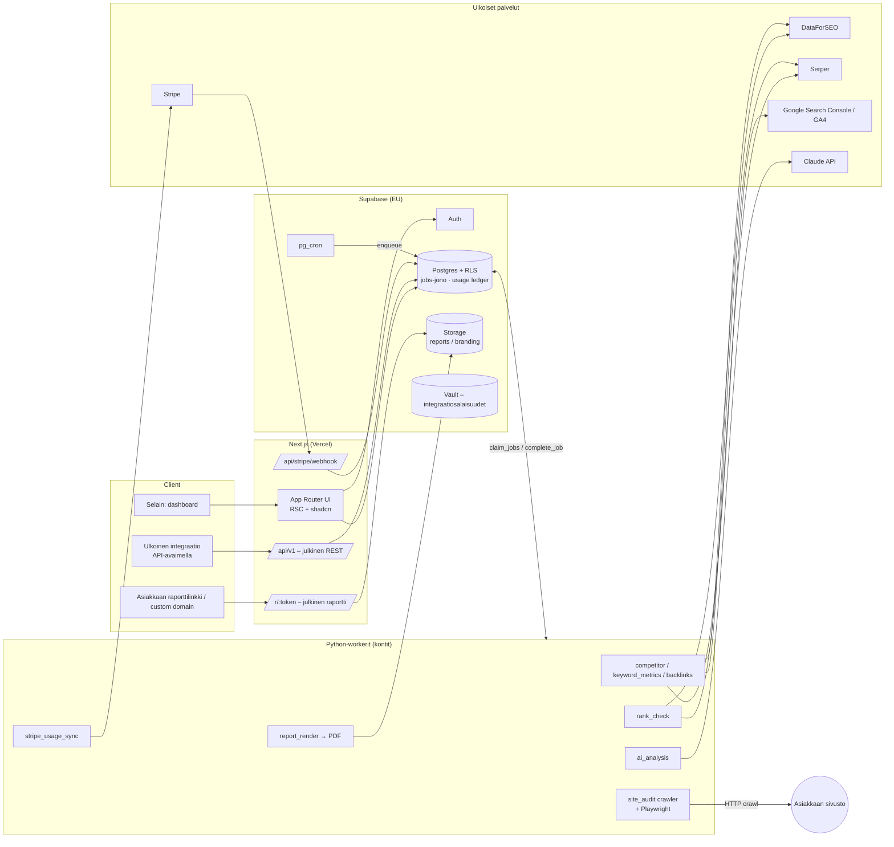
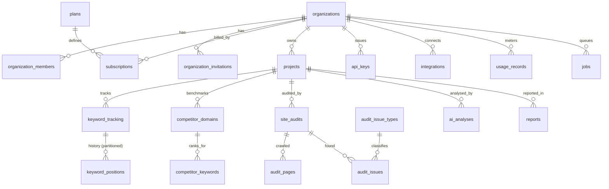

# OpenSEO – arkkitehtuuri

> **Tila:** v0.1 (luonnos päätöksentekoa varten) · 27.9.2026
> **Tavoite:** avoimeen lähdekoodiin ja edulliseen API-dataan perustuva SEO-alusta (SEMrush-vaihtoehto) omiin projekteihin, asiakastöihin ja myytäväksi SaaS-palveluna.
> **Näkökulmat:** SEO specialist & agentic search optimizer · backend architect & API platform engineer · frontend & data visualization · payments & billing · AppSec · product manager.

---

## 0. Tiivistelmä – keskeiset päätökset

| # | Päätös | Valinta | Miksi |
|---|---|---|---|
| D1 | Frontend + BFF | **Next.js 15 (App Router) + React + Tailwind + shadcn/ui** | SSR julkisille raporttisivuille ja SEO-landingeille, Route Handlerit API:lle ja Stripe-webhookeille, sama TypeScript-koodi UI:lle ja julkiselle API:lle. |
| D2 | Tietokanta, auth, storage | **Supabase (Postgres 15+, RLS, Auth, Storage, Vault, pg_cron)** | Multi-tenancy RLS:llä tietokantatasolla, valmis auth + SSO, edullinen aloittaa, ei vendor lock-inia (tavallinen Postgres). |
| D3 | Raskas työ | **Python 3.12 -workerit** (httpx/asyncio, selectolax, Playwright) kontteina (Fly.io / Hetzner / Railway) | Crawlaus, SERP-parsinta, data-analyysi (pandas/polars) ja AI-putki ovat Pythonissa luontevimpia; Edge Functionien aikaraja ja muisti eivät riitä crawleille. |
| D4 | Jono | **Postgres-natiivi jonotaulu `jobs` + `FOR UPDATE SKIP LOCKED`**, ajastus **pg_cron** | Ei uutta infraa (Redis/RabbitMQ), transaktionaalinen enqueue samassa kaupassa datan kanssa, jonon tila näkyy suoraan UI:lle RLS:n läpi. Päivityspolku: Supabase Queues (pgmq) tai Redis Streams kun > ~500 jobia/s. |
| D5 | Hakudata | **Provider-abstraktio**; ensisijainen **DataForSEO** (SERP, Labs, Backlinks), halpa fallback **Serper**, oma scraper vain audit-crawleriin | Pay-as-you-go, ei kuukausisitoumuksia (DataForSEO poisti ne 7/2026), per-kutsu hinnoittelu mahdollistaa käyttöperusteisen laskutuksen. |
| D6 | AI | **Claude API** (oletus `claude-opus-5`), Batch API + prompt caching, strukturoitu JSON-output | Laadukas analyysi reaalidatan päällä; batch = −50 % hinta ei-kiireellisille ajoille. |
| D7 | Laskutus | **Stripe Billing: kiinteä tilaus + Billing Meters** (ylityskäyttö) | Legacy usage records -API poistui (2025-03-31.basil) – Meters on ainoa tuettu tapa. |
| D8 | Raportit | **HTML-template (React Server Component) → PDF Playwrightilla**, white-label branding organisaatiotasolla | Yksi pohja sekä web- että PDF-raportille; brändäys + custom domain Agency-tasolla. |
| D9 | Repo | **Oma repo `openseo`** (tässä vaiheessa kansiossa `openseo/`) | Tämä repo on Akku-Turvan Mestari -sivusto, jonka `supabase/migrations` ajetaan sen tuotantokantaan. OpenSEO tarvitsee **oman Supabase-projektin**. |

---

## 1. Tavoitteet ja rajaukset

**MVP:n (v1) ydinominaisuudet**
1. **Projektit & domainit** – organisaatio → projektit (omat sivustot tai asiakkaat).
2. **Sijoitusseuranta** – avainsanat per maa/kieli/laite, päivittäin/viikoittain, historia, SERP-featuret (AI Overview, featured snippet, local pack, PAA).
3. **Avainsanatutkimus** – hakuvolyymi, KD, CPC, intentti; välimuisti jaetaan tenanttien kesken (julkista markkinadataa).
4. **Kilpailija-analyysi** – kilpailijan avainsanat ("takaisinmallinnus"), keyword gap (missing/weak/strong), näkyvyysindeksi.
5. **Site audit** – oma crawler, ~25 tarkistusta (sis. *AI readiness*: JS-riippuvainen sisältö, AI-crawlerien esto, strukturoitu data, llms.txt), health score.
6. **AI-analyysit** – audit-yhteenveto, sisällön laatuarvio, kilpailijagap-suositukset, avainsanaklusterointi, raporttien narratiivi.
7. **White-label-raportit** – web + PDF, ajastetut kuukausiraportit asiakkaille.
8. **Julkinen REST API** – API-avaimet, scopet, rate limit, kiintiöt.

**Ei MVP:ssä (myöhemmin):** oma backlink-indeksi (käytetään DataForSEO Backlinks APIa), oma clickstream-liikennearvio, PPC-tutkimus, sosiaalinen media.

**Laatutavoitteet:** tenant-eristys tietokantatasolla · jokainen maksullinen API-kutsu mitataan ja on idempotentti · worker-kaatuminen ei hukkaa töitä · raportti renderöityy < 30 s.

---

## 2. Teknologiapino

| Kerros | Teknologia | Huom. |
|---|---|---|
| UI | Next.js 15, React 19, TypeScript, Tailwind CSS v4, shadcn/ui, TanStack Query/Table | Server Components datalle, client-komponentit vain interaktiivisille osille |
| Kuvaajat | **Recharts** (dashboard), **ECharts** (raskaat aikasarjat, 10k+ pistettä), visx tarvittaessa | Sama väripaletti light/dark + PDF-tulosteessa |
| Auth | Supabase Auth (email+magic link, Google, SAML SSO Enterprise-tasolle) | JWT → RLS |
| DB | Supabase Postgres 15+, RLS, pg_cron, pg_trgm, pgcrypto, Vault | Osioitu `keyword_positions` (kuukausi) |
| Storage | Supabase Storage: `reports/`, `branding/` | Polku alkaa `<organization_id>/` → storage-RLS |
| Workerit | Python 3.12, `asyncpg`/`psycopg3`, `httpx`, `selectolax`, `playwright`, `anthropic`, `pydantic` | Yksi image, prosessityyppi valitaan `QUEUES`-muuttujalla |
| Edge Functions | Supabase Edge (Deno) – vain kevyet: Stripe-webhook (vaihtoehto Next-routelle), sähköposti-triggerit | Ei crawlausta |
| Laskutus | Stripe Billing, Checkout, Customer Portal, Billing Meters, Tax | |
| Sähköposti | Resend (tai Postmark) | Kutsut, raportit, varoitukset |
| Observability | Sentry (web + workerit), OpenTelemetry → Grafana Cloud / Axiom, Supabase-logit | Provider-kustannus metriikkana |
| CI/CD | GitHub Actions: lint, typecheck, pytest, **DB-testit (`tests/db/run.sh`)**, Supabase-migraatiot `supabase db push` | Preview-ympäristöt Supabase Branchingilla |
| Hosting | Vercel (web) · Fly.io/Hetzner (workerit) · Supabase (EU, Frankfurt) | GDPR: data EU:ssa |

---

## 3. Järjestelmäkaavio



**Pyyntöpolut**
- *Lukeminen (dashboard):* selain → Next.js RSC → Supabase (käyttäjän JWT) → RLS suodattaa. Ei service-avainta selaimeen koskaan.
- *Maksullinen toiminto (esim. audit):* UI kutsuu RPC:tä `request_site_audit()` → funktio tarkistaa roolin, kiintiön ja rinnakkaisuuden → kirjoittaa `site_audits` + `jobs` samassa transaktiossa → worker poimii.
- *Julkinen API:* `Authorization: Bearer oseo_…` → Next.js route → `verify_api_key()` (service role) → rate limit → `record_usage('api_call')` → kysely **tenant-rajatulla** kyselykerroksella (ks. §5.4).

---

## 4. Monorepon rakenne

```
openseo/
├── apps/
│   └── web/                     # Next.js 15 – UI, /api/v1, Stripe-webhook, julkiset raportit
│       ├── app/(marketing)/     # landing, hinnasto (lukee plans-taulua)
│       ├── app/(app)/[org]/[project]/…   # dashboard: rankings, keywords, competitors, audit, reports
│       ├── app/api/v1/…         # julkinen REST API (OpenAPI-skeema generoidaan zodista)
│       ├── app/api/stripe/webhook/route.ts
│       └── app/r/[token]/       # julkinen / white-label raporttinäkymä
├── workers/
│   └── python/
│       ├── openseo_workers/
│       │   ├── runner.py        # claim → dispatch → heartbeat → complete/fail
│       │   ├── providers/       # SerpProvider / KeywordDataProvider / BacklinkProvider -adapterit
│       │   ├── rank/            # rank_check-käsittelijä, SERP-featurejen parsinta
│       │   ├── audit/           # crawler, tarkistukset (issue_code ↔ audit_issue_types), health score
│       │   ├── ai/              # prompt-versiot, JSON-skeemat, batch-ajot
│       │   └── reports/         # HTML → PDF (Playwright)
│       ├── tests/
│       └── pyproject.toml
├── packages/
│   └── shared/                  # generoidut DB-tyypit (supabase gen types), zod-skeemat, plan-konfiguraatio
├── supabase/
│   ├── migrations/              # 20260927120000_openseo_core_schema.sql …
│   └── functions/               # kevyet Edge Functionit (valinnainen)
├── tests/db/                    # migraation + RLS-testit tavallista Postgresia vasten
│   ├── supabase_stub.sql
│   ├── rls_isolation_test.sql
│   └── run.sh
└── docs/ARCHITECTURE.md
```

---

## 5. Multi-tenancy & tietoturva (AppSec)

### 5.1 Tenant-malli
- **Organisaatio = tenant.** Käyttäjä voi kuulua useaan organisaatioon (freelancer + asiakkaan oma org). Rekisteröityessä luodaan automaattisesti henkilökohtainen työtila (`handle_new_user`).
- **Roolit:** `viewer < admin < owner` (järjestetty enum → `role >= 'admin'`).
  - *viewer:* lukee kaiken organisaation datan (sopii asiakkaan edustajalle).
  - *admin:* hallitsee projekteja, avainsanoja, kilpailijoita, raportteja, API-avaimia, integraatioita; kutsuu jäseniä (ei omistajia).
  - *owner:* lisäksi laskutus, omistajaroolit ja organisaation poisto.
- **Asiakastyö kahdella tavalla:** (a) asiakas omana organisaationa (asiakas maksaa itse / saa oman kirjautumisen), tai (b) asiakas projektina toimiston organisaatiossa (`projects.is_client_project`, `client_name`) – white-label-raportit ja projektikohtaiset API-avaimet.

### 5.2 Suojauskerrokset tietokannassa
1. **RLS kaikissa `public`-tauluissa.** Apufunktiot `private.has_org_role()` ovat `SECURITY DEFINER` + `search_path = ''`, ja `private`-skeema ei ole PostgREST:n kautta näkyvissä.
2. **`organization_id` johdetaan aina triggerillä** vanhemmasta rivistä (projekti → avainsana → sijoitus, audit → sivu → issue). Asiakkaan lähettämä `organization_id` ylikirjoitetaan → rivejä ei voi "istuttaa" toiseen tenanttiin. Lisäksi komposiitti-FK `(project_id, organization_id)`.
3. **Workerien tuottama data on käyttäjille read-only** (`keyword_positions`, `audit_*`, `competitor_keywords`, `usage_records`, `subscriptions`, `jobs`). Vain `service_role` kirjoittaa.
4. **Sarakekohtaiset GRANTit**: `api_keys.key_hash`, `organizations.stripe_customer_id` ja `integrations.vault_secret_id` eivät ole asiakkaan luettavissa/kirjoitettavissa.
5. **Osiot `private`-skeemassa**: Postgresin osiot eivät peri vanhemman RLS:ää, joten `keyword_positions_YYYY_MM` luodaan skeemaan, jota ei julkaista.
6. **Rahaa maksavat toiminnot RPC:n kautta** (`request_site_audit`, `create_api_key`, `invite_member`) – rooli + kiintiö + rinnakkaisuus tarkistetaan yhdessä transaktiossa. Plan-rajat (projektit, avainsanat, istuimet, kilpailijat) pakotetaan **triggereillä**, joten niitä ei voi ohittaa suoralla PostgREST-kutsulla.
7. **Viimeinen omistaja suojattu**, adminit eivät voi myöntää/poistaa owner-roolia, **audit_log** tietoturvakriittisille tapahtumille.
8. **Storage-RLS**: polun ensimmäinen kansio = `organization_id`, validoidaan turvallisella `try_uuid()`-muunnoksella.

Kaikki yllä oleva on **testattu** (`tests/db/run.sh`, 13 skenaariota: ristiin-tenant-luku/-kirjoitus, roolieskalaatio, plan-rajat, API-avainten hash/revokointi, kiintiöt + idempotenssi, jono, anon-rajaus, cascade-poisto).

### 5.3 API-avaimet
- Muoto `oseo_<64 hex>` (256 bittiä entropiaa). Kannassa vain `sha256(key)` + näkyvä prefix. Plaintext palautetaan **kerran** `create_api_key()`-funktiosta.
- Scopet: `read`, `keywords:write`, `audits:run`, `competitors:write`, `reports:read`, `reports:write`. Valinnainen **projektirajaus** (asiakkaalle annettava avain näkee vain oman projektinsa).
- Vanheneminen, revokointi, `last_used_at` (throttlattu kirjoitus), `rate_limit_per_min` (toteutus: Upstash Redis tai Postgres token bucket).
- GitHub secret scanning -kumppanuus myöhemmin (prefix `oseo_` mahdollistaa).

### 5.4 Julkisen API:n tenant-rajaus
API-reitit ajetaan service-roolilla (koska kutsujalla ei ole Supabase-JWT:tä), joten **jokainen kysely kulkee `TenantScope`-kerroksen läpi**, joka lisää `organization_id = :org` (+ `project_id = :project` jos avain on rajattu). Vaihtoehto (suositus v1.1): API-reitti vaihtaa lyhytikäiseen, itse allekirjoitettuun JWT:hen `{sub: api_key_id, org_id, role: 'authenticated'}`, jolloin samat RLS-politiikat pätevät myös API:ssa. Tästä erillinen ADR.

### 5.5 Muut
- Salaisuudet (GSC OAuth -tokenit, BYOK DataForSEO -avaimet) **Supabase Vaultissa**; taulussa vain viite.
- Crawler: SSRF-suojaus (estä yksityiset IP-avaruudet, metadata-endpointit, redirectit sisäverkkoon), robots.txt-kunnioitus oletuksena, oma User-Agent `OpenSEOBot/1.0 (+https://…/bot)`, per-domain nopeusrajoitus.
- Prompt injection: crawlattu sisältö on **dataa**, ei ohjeita – AI-promptit erottavat sen `<document>`-lohkoihin ja tulosteet validoidaan JSON-skeemaa vasten.
- GDPR: DPA asiakkaille, data EU:ssa, käyttäjän poisto → henkilötiedot pois, `audit_log` anonymisoidaan.

---

## 6. Tietomalli



| Taulu | Rooli | Huomioita |
|---|---|---|
| `plans` | Tuotekatalogi | `limits` JSONB: kovat rajat + kuukausikiintiöt + feature-liput. Stripe price -id:t. |
| `organizations` | Tenant | White-label-kentät (brand_name, logo, värit, footer, custom domain). |
| `organization_members` / `_invitations` | Jäsenyys | Kutsutoken hashattuna; hyväksyntä vaatii saman sähköpostin. |
| `subscriptions` | Stripe-peili | Yksi "live" tilaus / org (osittainen unique-indeksi). `limit_overrides` enterprise-sopimuksille. |
| `projects` | Sivusto / asiakas | `domain` normalisoitu (check), oletus-sijainti (DataForSEO location code, 2246 = Suomi) ja kieli. |
| `keyword_tracking` | Seurattava avainsana | Normalisoitu avainsana, metriikat, ajastus (`frequency`, `depth`, `next_check_at`) ja **denormalisoitu viimeisin sijoitus** dashboardin nopeuttamiseksi. |
| `keyword_positions` | Sijoitushistoria | **Kuukausiosiot**, PK `(keyword_id, check_date)` → yksi mittaus/päivä, upsert idempotentti. |
| `competitor_domains` / `competitor_keywords` | Kilpailija-analyysi | Snapshot per päivä; `gap_type` (missing/weak/strong) generoitu sarake. |
| `site_audits` / `audit_pages` / `audit_issues` / `audit_issue_types` | Tekninen audit | Tarkistuskatalogi seedattu (25 tarkistusta, 6 kategoriaa), painot health scorelle. |
| `api_keys` / `integrations` | Kytkennät | Sisään (API-avaimet) ja ulos (GSC, GA4, BYOK, Slack, webhook). |
| `usage_records` | Mittauskirjanpito | Idempotenssiavain = Stripe meter event identifier; `provider_cost_usd` katelaskentaan. |
| `jobs` | Jono | Prioriteetti, yritykset, backoff, heartbeat, dedupe. |
| `ai_analyses` / `reports` | AI & raportointi | Tokenit + kustannus, `input_hash`-välimuisti; raporttien jakolinkit hashattuna. |
| `private.keyword_metrics` / `private.provider_cache` | Jaettu välimuisti | Tenanttien yhteinen markkinadata → suurin kustannussäästö. |

**Kasvu ja skaalaus:** `keyword_positions` on suurin taulu (10k asiakasta × 1000 kw × 365 pv ≈ 3,6 mrd riviä/v → osiointi + vanhojen osioiden siirto halvempaan tallennukseen / aggregointi viikkotasolle > 13 kk). `audit_pages`/`audit_issues` siivotaan säilytyspolitiikalla (esim. 5 viimeisintä auditia / projekti). `usage_records` osioidaan kuukausittain kun > 50 M riviä.

---

## 7. Asynkroninen jono & workerit

### 7.1 Jonot

| Queue | Laukaisija | Tyypillinen kesto | Rinnakkaisuus | Huom. |
|---|---|---|---|---|
| `rank_check` | pg_cron 10 min välein → `enqueue_due_rank_checks()` | 5–60 s / 100 kw | korkea | Batch ≤ 100 avainsanaa / job; `next_check_at` hajautetaan 6 h ikkunaan hashilla. |
| `keyword_metrics` | uusi avainsana, kuukausipäivitys | 2–10 s | keskitaso | Luetaan ensin `private.keyword_metrics`-välimuistista. |
| `site_audit` | `request_site_audit()` / ajastus | 1–60 min | rajattu per domain | Heartbeat + progress; välitulokset tallennetaan → jatkettavissa. |
| `competitor_discovery` / `competitor_keywords` | uusi kilpailija, viikoittain | 10–120 s | keskitaso | DataForSEO Labs `competitors_domain`, `ranked_keywords`. |
| `backlinks` | käyttäjän pyyntö | 2–20 s | matala | Kallis → aina kiintiön alla. |
| `ai_analysis` | audit valmis, käyttäjän pyyntö, raportti | 5–120 s (batch: < 24 h) | API-rajojen mukaan | Kiireettömät Batch APIin. |
| `report_render` | käyttäjä / ajastus (kk-raportit) | 5–30 s | matala | Playwright-pooli. |
| `stripe_usage_sync` | pg_cron 15 min | < 10 s | 1 | Lähettää raportoimattomat `usage_records` Stripe Meter Eventseinä. |
| `integration_sync` | yöllinen | vaihtelee | matala | GSC-klikit/impressiot → vertailu sijoituksiin. |
| `maintenance` | yöllinen | – | 1 | Osiot, välimuistin siivous, vanhat jobit. |

### 7.2 Workerin elinkaari
```
loop:
  jobs = claim_jobs(queues, worker_id, limit=N)        # SKIP LOCKED, vapauttaa jumittuneet
  for job in jobs (asyncio, semaphore per queue):
      heartbeat_job() 30 s välein (+ progress)
      ok = record_usage(..., idempotency_key=f"{job.id}:{step}")  # kiintiö ennen kallista kutsua
      if not ok.allowed: fail_job(retryable=false, "quota_exceeded")
      tee työ → kirjoita tulokset (upsert, idempotentti)
      complete_job(result) | fail_job(error, retryable)   # backoff 30 s → 2 min → 8 min … max 6 h
```
- **Idempotenssi:** kaikki kirjoitukset upsertteja luonnollisella avaimella (`(keyword_id, check_date)`, `(audit_id, url)`), usage-idempotenssiavain johdetaan jobista.
- **Reiluus:** maksavien tilausten jobit saavat pienemmän `priority`-arvon; per-organisaatio rinnakkaisuusraja estää yhden asiakkaan jonon tukkimisen.
- **Skaalaus:** workerit ovat tilattomia → skaalataan jonopituuden mukaan (Fly Machines autoscale / KEDA Postgres-scaler). Crawler-poolit erikseen (muisti), Playwright erikseen.
- **Päivityspolku:** jos jonon läpimeno kasvaa yli Postgresin mukavuusalueen, `jobs` jää tilataulu(ksi) UI:lle ja varsinainen jakelu siirtyy pgmq:lle / Redis Streamsille – rajapinta (`claim/heartbeat/complete/fail`) pysyy samana.

---

## 8. Hakudataputki

### 8.1 Provider-abstraktio
```python
class SerpProvider(Protocol):
    name: str
    async def organic(self, q: SerpQuery) -> SerpResult: ...          # q: keyword, location_code, language, device, depth
    def estimate_cost(self, q: SerpQuery) -> Decimal: ...

class KeywordDataProvider(Protocol):
    async def metrics(self, keywords: list[str], loc: int, lang: str) -> list[KeywordMetrics]: ...
    async def ideas(self, seed: str, loc: int, lang: str, limit: int) -> list[KeywordMetrics]: ...
    async def ranked_keywords(self, domain: str, loc: int, lang: str, limit: int) -> list[RankedKeyword]: ...
    async def competitors(self, domain: str, loc: int, lang: str) -> list[CompetitorDomain]: ...

class BacklinkProvider(Protocol):
    async def summary(self, target: str) -> BacklinkSummary: ...
    async def referring_domains(self, target: str, limit: int) -> list[RefDomain]: ...
```
**Router** valitsee providerin: (1) organisaation BYOK-avain jos asetettu (`integrations.dataforseo_byok`), (2) ensisijainen, (3) fallback virhetilanteessa / budjetin ylittyessä. Jokainen kutsu → `provider_cache` (avain = sha256(provider|endpoint|kanoniset parametrit), TTL endpointin mukaan) → `record_usage(..., provider_cost_usd)`.

### 8.2 Hinnat (tarkistettu 9/2026 – varmista ennen sopimuksia)

| Palvelu | Hinta | Käyttö |
|---|---|---|
| DataForSEO SERP, Standard queue | **$0,0006 / SERP-sivu (10 tulosta)**; lisäsivut 0,75 × perushinta. Priority $0,0012, Live $0,002 | Sijoitusseuranta (jonotettu, halvin) |
| DataForSEO Labs | ~$0,012 / tehtävä + $0,00012 / rivi | Avainsanametriikat, ranked keywords, kilpailijat |
| DataForSEO Backlinks | ~$0,024 / pyyntö + $0,000036 / rivi; ei enää $100/kk minimiä (7/2026 alkaen) | Backlink-profiili |
| Serper.dev | ~$0,30–1,00 / 1000 hakua (paketista riippuen), >10 tulosta = 2 krediittiä | Fallback, reaaliaikaiset ad-hoc-SERPit |
| Oma crawler | vain laskenta (~$0,5–2 / 25k sivua) | Site audit |

**Tärkeä muutos:** Google poisti käytännössä `num=100`-parametrin syyskuussa 2025, joten providerit laskuttavat nyt **jokaisesta 10 tuloksen sivusta**. Top-100-seuranta maksaa ~7–10× top-10:n verran. Siksi:

### 8.3 Sijoitusseurannan kustannusstrategia
- **Adaptiivinen syvyys:** tarkista päivittäin vain niin syvälle kuin avainsana viimeksi sijoittui + 1 sivu (esim. sijoitus 14 → depth 20). Ei sijoitusta → top 20 päivittäin + top 100 viikoittain.
- **Standard queue** (ei Live) – tulokset tunneissa, riittää päivittäiseen seurantaan. Live vain "tarkista nyt" -napille (kuluttaa `serp_query`-kiintiötä).
- **Deduplikointi tenanttien välillä:** sama avainsana + sijainti + kieli + laite samana päivänä → yksi provider-kutsu, jaetaan `provider_cache`:n kautta (ranking on sama kaikille; vain oma domain haetaan tuloksista).
- **Arvio Pro-tasolle:** 500 kw × 30 pv × ~1,4 sivua ≈ 21 000 SERP-sivua ≈ **$12–16 / kk**.

### 8.4 Site audit -crawler
- `httpx` + `selectolax` (nopea HTML-parsinta), per-host concurrency 2–4, kunnioittaa `robots.txt`/`crawl-delay`, sitemap-siemenet, URL-normalisointi, max depth.
- **JS-renderöinti** valinnaisena (Playwright) – vertailu raaka-HTML vs. renderöity → `js_only_content`-tarkistus (tärkeä AI-agenteille ja LLM-crawlereille, jotka eivät suorita JS:ää).
- Core Web Vitals: CrUX API (ilmainen, kenttädata) + Lighthouse näytteenä valituille sivuille.
- Tarkistukset ovat puhtaita funktioita `page → list[Issue]`, koodi ↔ `audit_issue_types.code`. **Health score** = 100 − Σ(paino × esiintymäosuus) kategoria-cappien kanssa.

### 8.5 Kilpailijaputki ("takaisinmallinnus")
1. `competitors_domain` → ehdotetut kilpailijat (`source = auto_discovered`).
2. `ranked_keywords` jokaiselle kilpailijalle → `competitor_keywords` (snapshot).
3. Yhdistä omaan dataan (`keyword_tracking` + Labs `ranked_keywords` omalle domainille) → `our_position` → `gap_type`.
4. AI-vaihe: klusteroi puuttuvat avainsanat aiheiksi, arvioi intentti ja tuota sisältösuositukset (§9).

---

## 9. AI-analyysiputki

**Periaate:** LLM ei keksi dataa – se **tulkitsee reaalidataa**, jonka putki on jo hakenut (SERP, audit, kilpailijat, GSC). Jokainen analyysi = deterministinen datankeruu → kompakti JSON-konteksti → LLM → **JSON-skeemavalidoitu** tulos → tallennus `ai_analyses`.

| Analyysi (`kind`) | Syöte | Tulos | Ajotapa |
|---|---|---|---|
| `audit_summary` | issue-aggregaatit, top-URLit | priorisoitu korjauslista, vaikutus/työmäärä | Batch (audit valmis) |
| `content_quality` | sivun teksti + SERP top-10 otsikot/kuvaukset | E-E-A-T-, kattavuus- ja intenttiarvio, puuttuvat aiheet | Pyynnöstä |
| `competitor_gap` | gap-avainsanat + volyymit | aiheklusterit, sisältösuunnitelma | Batch |
| `keyword_clustering` | avainsanalista + SERP-päällekkäisyys | klusterit, pilarisivut | Batch |
| `serp_intent` | SERP-featuret, tulosten tyypit | intentti + formaattisuositus | Batch |
| `ai_search_visibility` | AI Overview -viittaukset, `owns_ai_overview`, strukturoitu data | GEO-/AI-hakunäkyvyyssuositukset | Pyynnöstä |
| `report_narrative` | raportin KPI-muutokset | asiakasystävällinen tiivistelmä (fi/en) | Raportin renderöinti |

**Toteutus**
- Anthropic Python SDK. Oletusmalli **`claude-opus-5`** (adaptive thinking, `effort` säädettävissä per analyysityyppi). Malli on konfiguroitavissa per `kind` – kevyempään malliin siirtyminen massaluokittelussa on liiketoimintapäätös, joka tehdään mittausten perusteella (ks. avoimet kysymykset).
- **Message Batches API** kaikille kiireettömille ajoille (−50 % hinta).
- **Prompt caching:** vakaa järjestelmäprompti + tarkistuskatalogi + skeemat cachetaan; muuttuva data viimeisenä.
- **Strukturoitu output** (`output_config.format` / JSON Schema) → Pydantic-validointi → hylkäys ja uusinta virheellisellä tuloksella.
- **Välimuisti:** `input_hash = sha256(prompt_version + kanoninen syöte)` → sama analyysi samalle datalle ei maksa uudelleen.
- **Kustannusmittari:** 1 `ai_credit` ≈ 1 000 output-tokenia oletusmallilla; todellinen `cost_usd` tallennetaan `ai_analyses`-riville katelaskentaa varten.
- **Turvallisuus:** crawlattu sisältö erotetaan dokumenttilohkoihin ja merkitään epäluotetuksi; malli ei saa työkaluja, jotka kirjoittaisivat tietokantaan.

---

## 10. Raportointi & white-label

- **Yksi raporttimalli, kaksi ulostuloa:** React Server Component -raportti (`/r/[token]`) → sama HTML PDF:ksi Playwrightilla (`report_render`-worker) → `reports/<org_id>/<report_id>.pdf` Storageen.
- **Osiot (`reports.sections`):** KPI-kortit (näkyvyys, keskisijoitus, top-3/top-10-avainsanat, arvioitu liikenne), sijoituskehitys, voittajat/häviäjät, SERP-featuret, audit health score + top-issuet, kilpailijavertailu, AI-narratiivi, GSC-klikit.
- **White-label (Agency):** logo, värit, oma footer, "Powered by OpenSEO" pois, **custom domain** (`reports.toimisto.fi` CNAME → Vercel, TLS automaattisesti), lähettäjänä toimiston nimi.
- **Jakaminen:** satunnainen token (vain hash kantaan), vanheneminen, valinnainen salasana; ajastetut kuukausiraportit (`schedule_cron`, `recipients`).
- **Branding snapshot** tallennetaan raporttiin renderöintihetkellä → vanhat raportit eivät muutu, jos brändi vaihtuu.
- **Datavisualisointi:** yhtenäinen värijärjestelmä (light/dark/print), aikasarjat ECharts (canvas → PDF-yhteensopiva), saavutettavat kontrastit, yhteinen komponenttikirjasto dashboardille ja raporteille.

---

## 11. Kaupallistaminen

### 11.1 Paketit (seedattu `plans`-tauluun, hinnat alv 0 %)

| | **Free** | **Pro** | **Agency** | **Enterprise** |
|---|---|---|---|---|
| Hinta | 0 € | **49 €/kk** (490 €/v) | **149 €/kk** (1 490 €/v) | sopimus |
| Projektit | 1 | 5 | 40 | ∞ |
| Seurattavat avainsanat | 25 (viikoittain) | 500 (päivittäin) | 3 000 (päivittäin) | ∞ |
| Käyttäjät | 1 | 3 | 10 | ∞ |
| Kilpailijat / projekti | 2 | 10 | 20 | ∞ |
| Audit-sivut / kk (max / audit) | 500 (250) | 25 000 (5 000) | 200 000 (25 000) | ∞ (100 000) |
| Avainsanahaut / kk | 50 | 3 000 | 15 000 | ∞ |
| Ad-hoc SERP / kk | 300 | 5 000 | 30 000 | ∞ |
| Backlink-kyselyt / kk | 10 | 200 | 1 500 | ∞ |
| AI-krediitit / kk | 20 | 200 | 1 200 | ∞ |
| API | – | 10 000 kutsua | 100 000 kutsua | ∞ |
| White-label + custom domain | – | – | ✓ | ✓ |
| Ylityskäyttö (meters) | – | ✓ | ✓ | ✓ |

Vertailukohta: SEMrush Pro $139,95/kk, Guru $249,95/kk, Business $499,95/kk → OpenSEO asemoituu **selvästi edullisemmaksi** ja kilpailee läpinäkyvyydellä (käyttöperusteinen, API mukana, white-label jo 149 €:lla).

### 11.2 Katelaskelma (Pro, 100 % käyttöaste, arvio)

| Kulu | $/kk |
|---|---|
| Sijoitusseuranta (≈21k SERP-sivua) | 12–16 |
| Avainsanahaut 3 000 (Labs, välimuistilla) | 1–3 |
| Backlinks 200 kyselyä | 5–6 |
| Audit 25k sivua (laskenta) | 1–2 |
| AI 200 krediittiä (Batch + caching) | 4–8 |
| Stripe-maksut + infra-osuus | 3–4 |
| **Yhteensä** | **≈ 26–39** vs. liikevaihto ≈ 53 $ |

Todellinen keskimääräinen käyttöaste SaaS-työkaluissa on tyypillisesti 30–50 % → bruttokate ~65–80 %. **Seuranta:** `usage_records.provider_cost_usd` → katedashboard per organisaatio ja per paketti; hälytys jos tenantin kate < 30 %.

### 11.3 Stripe-integraatio
- **Tuotteet:** yksi Product per paketti, kuukausi- ja vuosihinta (`plans.stripe_price_*`).
- **Billing Meters** (yksi per mittari): `openseo_serp_query`, `openseo_keyword_lookup`, `openseo_audit_page`, `openseo_backlink_query`, `openseo_ai_credit`, `openseo_api_call`. Metered-hinnat **graduated tiers**: ensimmäiset N (= paketin kiintiö) 0 €, sen jälkeen yksikköhinta. Tilaukseen liitetään perus-price + metered-pricet.
- **Usage sync:** `stripe_usage_sync`-worker lähettää `usage_records`-rivit, joilla `stripe_reported_at is null`, Meter Eventseinä (`identifier = idempotency_key` → Stripe deduplikoi), merkitsee raportoiduksi. Kirjanpito on meillä – Stripe on laskutuksen, ei kiintiöiden, totuus.
- **Webhookit** (allekirjoitus tarkistetaan, käsittely idempotentti `event.id`:llä): `checkout.session.completed`, `customer.subscription.created|updated|deleted`, `invoice.paid`, `invoice.payment_failed`, `customer.subscription.trial_will_end` → upsert `subscriptions`.
- **Dunning:** `past_due` säilyttää pääsyn (grace), `unpaid`/`canceled` → Free-rajat (dataa ei poisteta, ylimenevät avainsanat pausetetaan).
- **Customer Portal** paketin vaihtoon, kortin päivitykseen ja laskuihin; **Stripe Tax** EU-ALV:lle (käänteinen verovelvollisuus Y-tunnuksella / VAT ID:llä).
- **Kiintiöiden valvonta** tapahtuu meillä reaaliajassa (`record_usage` + advisory lock), ei Stripen päässä.

---

## 12. Julkinen REST API (v1)

- Perus-URL `/api/v1`, auth `Authorization: Bearer oseo_…`, JSON, kursori-sivutus, `Idempotency-Key`-otsake kirjoittaville kutsuille.
- Esimerkkiresurssit: `GET /projects`, `GET /projects/{id}/keywords`, `POST /projects/{id}/keywords`, `GET /projects/{id}/rankings?from&to`, `POST /projects/{id}/audits`, `GET /audits/{id}/issues`, `GET /projects/{id}/competitors/gap`, `GET /reports/{id}`.
- Vastausotsakkeet: `X-RateLimit-*`, `X-Quota-Remaining-<metric>`.
- OpenAPI 3.1 generoidaan zod-skeemoista → SDK:t ja Looker Studio -/Zapier-kytkennät.
- **MCP-palvelin** (v1.2): sama API MCP-työkaluina → asiakkaat voivat kysyä SEO-dataansa AI-agenteilla (agentic search -näkökulma).

---

## 13. Ympäristöt, laatu & operointi

- **Ympäristöt:** `local` (Supabase CLI + docker) → `preview` (Supabase Branching per PR) → `staging` → `production`. Oma Supabase-projekti OpenSEO:lle, EU-alue.
- **CI:** `pnpm lint typecheck test`, `pytest`, **`tests/db/run.sh`** (migraatio + RLS-testit tavallista PG:tä vasten), `supabase db lint`, Supabase Advisors (security/performance) ennen tuotantoon vientiä.
- **Tietokantamuutokset:** vain migraatioiden kautta, ei dashboard-muutoksia; generoidut TS-tyypit `packages/shared`.
- **Havainnointi:** jonon pituus & ikä per queue, jobien virheprosentti, provider-latenssi & -kustannus/pv, kate per paketti, Stripe-synkkauksen viive.
- **Varmuuskopiot:** Supabase PITR (Pro-taso), kuukausittainen palautustesti.

---

## 14. Roadmap

| Vaihe | Sisältö | Arvio |
|---|---|---|
| **0 – Perusta** (tämä PR) | Arkkitehtuuri, tietokantaskeema + RLS + testit | ✓ |
| **1 – MVP sisäiseen käyttöön** | Next.js-runko, auth, org/projekti-UI, avainsanaseuranta (DataForSEO), rank-dashboard, workerirunko | 3–4 vk |
| **2 – Audit & kilpailijat** | Crawler + 25 tarkistusta, audit-UI, kilpailijat + gap | 3–4 vk |
| **3 – Raportit & AI** | Raporttipohja, PDF, white-label, AI-yhteenvedot | 2–3 vk |
| **4 – Kaupallinen beta** | Stripe (tilaukset + meters), hinnastosivu, julkinen API, onboarding | 2–3 vk |
| **5 – Kasvu** | GSC/GA4-integraatiot, backlinks, MCP-palvelin, ajastetut raportit, Enterprise SSO | jatkuva |

---

## 15. Avoimet kysymykset (tarvitaan päätös)

1. **Repo:** siirretäänkö `openseo/` omaan GitHub-repoon (suositus) ja luodaanko sille oma Supabase-projekti (EU)?
2. **Lisenssi:** avoin lähdekoodi millä mallilla? Vaihtoehdot: **AGPL-3.0** (suojaa SaaS-kopioilta, sallii itse-hostauksen) · open core (MIT-ydin + suljettu Agency/Enterprise) · BSL/FSL (muuttuu avoimeksi viiveellä).
3. **Ensisijainen markkina ja kieli:** Suomi/Pohjoismaat ensin (fi/sv/en UI, paikalliset hakukoneasetukset) vai suoraan kansainvälinen (en)?
4. **Hinnat:** 49 € / 149 € -hinnoittelu on lähtöoletus katelaskelman pohjalta – validoidaanko 5–10 potentiaalisen asiakkaan kanssa ennen julkaisua?
5. **AI-mallivalinta:** pidetäänkö `claude-opus-5` kaikissa analyyseissä, vai testataanko kevyempää mallia massaluokitteluun (esim. klusterointi) laatu/kustannus-mittauksella?
6. **Hosting-budjetti workereille:** Fly.io (helppo, ~20–50 $/kk alussa) vai Hetzner (halvin, enemmän ylläpitoa)?
7. **BYOK:** saavatko Agency-asiakkaat käyttää omaa DataForSEO-avaintaan (alempi hinta, ei data-kiintiöitä)?

---

### Lähteet (hinnat ja rajapintamuutokset, tarkistettu 27.9.2026)
- DataForSEO SERP API -hinnoittelu: https://dataforseo.com/apis/serp-api/pricing
- DataForSEO depth-/hinnoittelumuutos (num=100): https://dataforseo.com/update/google-organic-serp-api-critical-updates-depth
- DataForSEO hinnoittelupäivitys 7/2026: https://dataforseo.com/update/pricing-update-in-dataforseo-apis
- DataForSEO Backlinks -hinnoittelu: https://dataforseo.com/pricing/backlinks/backlinks
- Serper.dev: https://serper.dev/
- Stripe Billing Meters: https://docs.stripe.com/api/billing/meter · legacy usage records poisto: https://docs.stripe.com/changelog/basil/2025-03-31/deprecate-legacy-usage-based-billing
- SEMrush-hinnat 2026: https://www.demandsage.com/semrush-pricing/
- Agenttiroolit: https://github.com/msitarzewski/agency-agents
