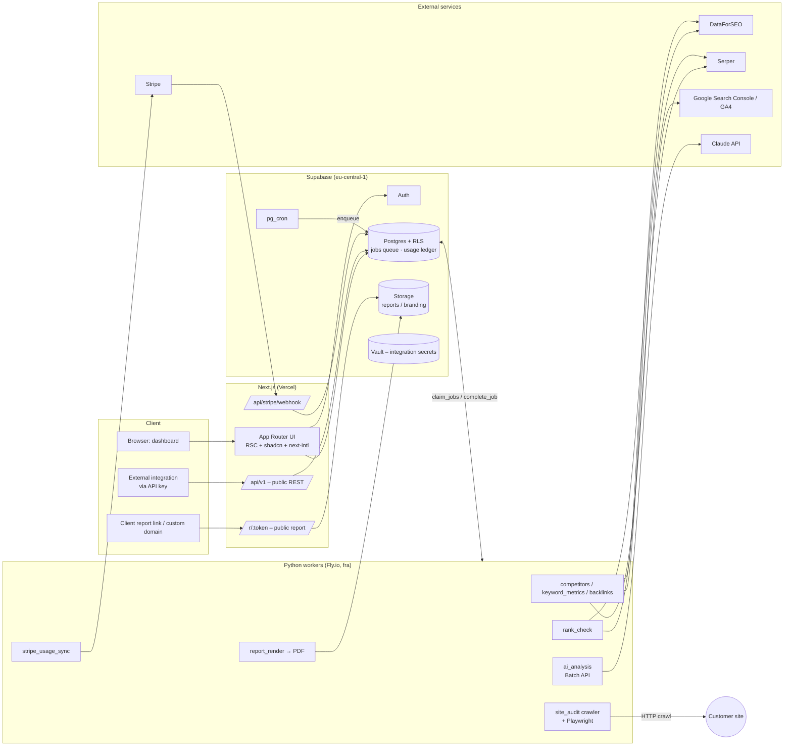
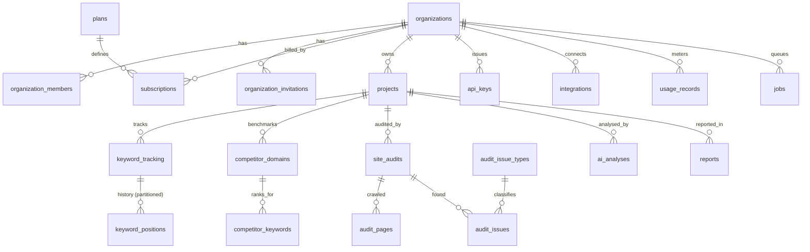

# BraiSEO – Architecture

> **Status:** v0.2 · 2026-09-27 · decisions D1–D14 accepted
> **Goal:** an open-source (AGPL-3.0), API-data-driven SEO platform — a SEMrush alternative — for our own sites, client work and as a commercial multi-tenant SaaS.
> **Perspectives applied:** SEO specialist & agentic search optimizer · backend architect & API platform engineer · frontend & data visualization · payments & billing · AppSec · product management.

---

## 0. Decision log

| # | Decision | Choice | Rationale |
|---|---|---|---|
| D1 | Frontend + BFF | **Next.js 16 (App Router, Turbopack, `proxy.ts`) + React 19 + Tailwind v4 + shadcn-style components** | SSR for public reports and marketing pages, Route Handlers for the public API and Stripe webhooks, one TypeScript codebase. |
| D2 | Database, auth, storage | **Supabase (Postgres 17, RLS, Auth, Storage, Vault, pg_cron)** — project `OpenSEO`, ref `itxtluifqbxxrealkpfj`, region **eu-central-1 (Frankfurt)** | Tenant isolation enforced in the database, managed auth/SSO, plain Postgres (no lock-in), EU data residency. |
| D3 | Heavy work | **Python 3.12 workers** (httpx/asyncio, selectolax, Playwright, anthropic SDK) | Crawling, SERP parsing, data work and the AI pipeline fit Python best; Edge Functions have too little time/memory for crawls. |
| D4 | Worker hosting | **Fly.io** (Machines, EU region `fra` next to the database) | Fastest to operate early on; per-second billing, autoscaling by process group. Re-evaluate Hetzner when steady-state load is known. |
| D5 | Queue | **Postgres-native `jobs` table + `FOR UPDATE SKIP LOCKED`**, scheduling via **pg_cron** | No extra infrastructure, transactional enqueue with the data, job state visible to the UI through RLS. Upgrade path: pgmq / Redis Streams above ~500 jobs/s. |
| D6 | Search data | **Provider abstraction**; primary **DataForSEO** (SERP, Labs, Backlinks), fallback **Serper**, own crawler for audits | Pay-as-you-go with no monthly commitment (DataForSEO dropped commitments in 07/2026) → cost scales with metered revenue. |
| D7 | AI | **Claude API with model tiering**: bulk work on lighter models via **Message Batches API (−50 %)**, deep analysis on **Opus** | Quality where it matters, lowest cost for high-volume classification. See §9. |
| D8 | Billing | **Stripe Billing: flat subscription + Billing Meters** for overage | Legacy usage records API was removed in `2025-03-31.basil`; Meters are the only supported path. |
| D9 | Reports | **One React template → web (`/r/[token]`) + PDF (Playwright)**, white-label per organization | Single source for web and PDF; branding + custom domain on Agency. |
| D10 | Repository | **Own repository `BraiGAIP/openseo`** | Keeps BraiSEO independent of other products and their Supabase projects. |
| D11 | License | **AGPL-3.0** | Anyone may self-host and modify; anyone offering it as a network service must publish their changes → protects against closed SaaS forks. |
| D12 | Market & language | **International from day one, English first**, i18n-ready for **Finnish and Swedish** | Largest addressable market; FI/SV give a home-market edge. |
| D13 | Pricing | **Free 0 € · Pro 49 €/mo · Agency 149 €/mo** (+ Enterprise on request) | Accepted; see §11. |
| D14 | Migrations | Only via files in `supabase/migrations`, verified by `tests/db/run.sh` and a schema fingerprint before production | Reproducible, reviewable schema; no dashboard drift. |
| D15 | Product name | **BraiSEO** (renamed from OpenSEO, 09/2026). Visible texts, Fly apps (`braiseo-web`, `braiseo-workers`) and docs use the new name; internal code names (`@openseo/*`, `openseo_workers`, repo, Supabase project) stay | Renaming internal identifiers adds risk without user benefit. The AGPL-3.0 choice (D11) is open for review — see §15. |

---

## 1. Scope

**MVP (v1) features**
1. **Projects & domains** — organization → projects (own sites or clients).
2. **Rank tracking** — keywords per country/language/device, daily/weekly, history, SERP features (AI Overview, featured snippet, local pack, PAA).
3. **Keyword research** — volume, difficulty, CPC, intent; cache shared across tenants (public market data).
4. **Competitor research** — competitors' keywords ("reverse engineering"), keyword gap (missing / weak / strong), visibility index.
5. **Site audit** — own crawler, ~25 checks including **AI readiness** (JS-only content, blocked AI crawlers, structured data, llms.txt), health score.
6. **AI analyses** — audit summary, content quality, competitor-gap recommendations, keyword clustering, report narrative.
7. **White-label reports** — web + PDF, scheduled monthly client reports.
8. **Public REST API** — API keys, scopes, rate limits, quotas.

**Not in MVP:** own backlink index (use DataForSEO Backlinks), clickstream traffic estimates, PPC research, social media.

**Quality goals:** tenant isolation enforced in the database · every paid provider call metered and idempotent · a crashed worker never loses work · report renders in < 30 s.

---

## 2. Technology stack

| Layer | Technology | Notes |
|---|---|---|
| UI | Next.js 16, React 19, TypeScript, Tailwind CSS v4, shadcn/ui, TanStack Query/Table | Server Components for data, client components only where interactive |
| i18n | **next-intl**, locales `en` (default), `fi`, `sv`; ICU messages in `apps/web/messages/*.json` | Locale-prefixed routes (`/fi/...`), `organizations.default_locale`, `reports.locale`, locale-aware number/date formatting |
| Charts | **Recharts** (dashboard), **ECharts** (large time series, 10k+ points) | One palette for light/dark/print |
| Auth | Supabase Auth (email + magic link, Google; SAML SSO for Enterprise) | JWT → RLS |
| Database | Supabase Postgres 17, RLS, pg_cron, pg_trgm, pgcrypto, Vault | Monthly-partitioned `keyword_positions` |
| Storage | Supabase Storage buckets `reports`, `branding` | Path starts with `<organization_id>/` → storage RLS |
| Workers | Python 3.12, `psycopg` 3, `httpx`, `selectolax`, `playwright`, `anthropic`, `pydantic` | One image; process groups select queues |
| Worker hosting | **Fly.io**, region `fra` | Process groups: `rank`, `crawl`, `render`, `ai`, `misc` |
| Edge Functions | Supabase Edge (Deno) — light tasks only (e-mail triggers) | No crawling |
| Billing | Stripe Billing, Checkout, Customer Portal, Billing Meters, Stripe Tax | |
| E-mail | Resend | Invitations, reports, alerts (localized templates) |
| Observability | Sentry (web + workers), OpenTelemetry → Grafana Cloud / Axiom, Supabase logs | Provider cost per day as a metric |
| CI/CD | GitHub Actions: lint, typecheck, pytest, **DB tests (`tests/db/run.sh`)**, `supabase db push` on `main` | Supabase Branching for PR previews (requires Supabase Pro) |
| Hosting | Vercel (web) · Fly.io (workers) · Supabase (Frankfurt) | GDPR: data in the EU |

---

## 3. System overview



**Request paths**
- *Read (dashboard):* browser → Next.js RSC → Supabase with the user's JWT → RLS filters rows. The service key never reaches the browser.
- *Paid action (e.g. audit):* UI calls RPC `request_site_audit()` → checks role, quota and concurrency → writes `site_audits` + `jobs` in one transaction → a worker picks it up.
- *Public API:* `Authorization: Bearer oseo_…` → Next.js route → `verify_api_key()` (service role) → rate limit → `record_usage('api_call')` → query through a **tenant-scoped** data layer (§5.4).

---

## 4. Repository layout

```
openseo/
├── apps/
│   └── web/                     # Next.js 16 – UI, /api/v1, Stripe webhook, public reports
│       ├── app/[locale]/(marketing)/   # landing, pricing (reads public.plans)
│       ├── app/[locale]/(app)/[org]/[project]/…   # rankings, keywords, competitors, audit, reports
│       ├── app/api/v1/…         # public REST API (OpenAPI generated from zod)
│       ├── app/api/stripe/webhook/route.ts
│       ├── app/r/[token]/       # public / white-label report view
│       └── messages/{en,fi,sv}.json
├── workers/
│   └── python/
│       ├── openseo_workers/
│       │   ├── runner.py        # claim → dispatch → heartbeat → complete/fail
│       │   ├── providers/       # SerpProvider / KeywordDataProvider / BacklinkProvider adapters
│       │   ├── rank/            # rank_check handler, SERP-feature parsing
│       │   ├── audit/           # crawler, checks (issue_code ↔ audit_issue_types), health score
│       │   ├── ai/              # model router, prompt versions, JSON schemas, batch jobs
│       │   └── reports/         # HTML → PDF (Playwright)
│       ├── fly.toml
│       └── pyproject.toml
├── packages/
│   └── shared/                  # generated DB types, zod schemas, plan config
├── supabase/
│   └── migrations/              # 20260927110858_openseo_core_schema.sql …
├── tests/db/                    # migration + RLS tests against plain PostgreSQL, schema fingerprint
├── .github/workflows/ci.yml
├── LICENSE                      # AGPL-3.0
└── docs/ARCHITECTURE.md
```

---

## 5. Multi-tenancy & security (AppSec)

### 5.1 Tenant model
- **Organization = tenant.** A user can belong to many organizations (freelancer + client's own org). Sign-up automatically creates a personal workspace (`handle_new_user`).
- **Roles:** `viewer < admin < owner` (ordered enum → `role >= 'admin'`).
  - *viewer:* reads all organization data (fits a client contact).
  - *admin:* manages projects, keywords, competitors, reports, API keys, integrations; invites members (not owners).
  - *owner:* additionally billing, owner roles and deleting the organization.
- **Client work, two ways:** (a) the client is its own organization (own login, may pay itself), or (b) the client is a project inside the agency organization (`projects.is_client_project`, `client_name`) with white-label reports and project-scoped API keys.

### 5.2 Database-level controls
1. **RLS on every `public` table.** Helpers such as `private.has_org_role()` are `SECURITY DEFINER` with `search_path = ''`; the `private` schema is not exposed through PostgREST.
2. **`organization_id` is always derived by trigger** from the parent row (project → keyword → position, audit → page → issue). Client-supplied `organization_id` is overwritten, so rows cannot be planted in another tenant. Composite FKs `(project_id, organization_id)` add a second guarantee.
3. **Worker-produced data is read-only for users** (`keyword_positions`, `audit_*`, `competitor_keywords`, `usage_records`, `subscriptions`, `jobs`); only `service_role` writes.
4. **Column-level grants:** `api_keys.key_hash`, `organizations.stripe_customer_id` and `integrations.vault_secret_id` are not readable or writable by clients.
5. **Partitions live in `private`:** Postgres partitions don't inherit the parent's RLS, so `keyword_positions_YYYY_MM` is created in a schema that is never exposed.
6. **Money-costing actions go through RPCs** (`request_site_audit`, `create_api_key`, `invite_member`): role, quota and concurrency are checked in one transaction. Plan caps (projects, keywords, seats, competitors) are enforced by **triggers** and cannot be bypassed via PostgREST.
7. **Last owner is protected**, admins cannot grant/revoke `owner`, and **`audit_log`** records security-relevant events.
8. **Storage RLS:** the first path segment is the `organization_id`, parsed with a safe `try_uuid()`.

All of the above is **tested** (`tests/db/run.sh`, 13 scenarios: cross-tenant read/write, role escalation, plan caps, API-key hashing/revocation, quotas + idempotency, job queue, anon access, cascade delete). The deployed database is verified against the tested build with `tests/db/fingerprint.sql` (functions, policies, columns, triggers, grants, seed data).

**Supabase security advisor:** the only findings are the 7 intentionally exposed `SECURITY DEFINER` RPCs (`create_organization`, `invite_member`, `accept_invitation`, `create_api_key`, `revoke_api_key`, `request_site_audit`, `get_usage_summary`). Each performs its own role check; they are accepted by design.

### 5.3 API keys
- Format `oseo_<64 hex>` (256 bits of entropy). Only `sha256(key)` and a display prefix are stored. The plaintext is returned **once** by `create_api_key()`.
- Scopes: `read`, `keywords:write`, `audits:run`, `competitors:write`, `reports:read`, `reports:write`. Optional **project scoping** (a key handed to a client sees only their project).
- Expiry, revocation, throttled `last_used_at`, `rate_limit_per_min` (Upstash Redis or a Postgres token bucket).
- The `oseo_` prefix enables GitHub secret-scanning partnership later.

### 5.4 Tenant scoping in the public API
API routes run with the service role (callers have no Supabase JWT), so **every query goes through a `TenantScope` layer** that adds `organization_id = :org` (+ `project_id = :project` for project-scoped keys). Planned for v1.1: the API route mints a short-lived JWT `{sub: api_key_id, org_id, role: 'authenticated'}` so the same RLS policies apply to API traffic. Separate ADR.

### 5.5 Other controls
- Secrets (GSC OAuth tokens, BYOK provider keys) in **Supabase Vault**; tables store only references.
- Crawler: SSRF protection (block private ranges, metadata endpoints, redirects into internal networks), `robots.txt` respected by default, identifiable UA `BraiSEOBot/1.0 (+https://brai.build/bot)`, per-host rate limits.
- Prompt injection: crawled content is **data, not instructions** — wrapped in document blocks, outputs validated against JSON schemas, and the model has no tools that write to the database.
- GDPR: DPA for customers, EU data residency, user deletion removes personal data and anonymises `audit_log`.

---

## 6. Data model



| Table | Role | Notes |
|---|---|---|
| `plans` | Product catalogue | `limits` JSONB: hard caps + monthly quotas + feature flags; Stripe price ids. |
| `organizations` | Tenant | White-label fields (brand name, logo, colours, footer, custom domain), `default_locale` (`en`/`fi`/`sv`). |
| `organization_members` / `_invitations` | Membership | Invitation token stored hashed; acceptance requires the same e-mail. |
| `subscriptions` | Stripe mirror | One live subscription per org (partial unique index); `limit_overrides` for enterprise deals. |
| `projects` | Site / client | Normalised `domain`; default location (DataForSEO code, default 2840 = US) and language (`en`). |
| `keyword_tracking` | Tracked keyword | Normalised keyword, metrics, schedule (`frequency`, `depth`, `next_check_at`), **denormalised latest position** for fast dashboards. |
| `keyword_positions` | Rank history | **Monthly partitions**, PK `(keyword_id, check_date)` → one measurement per day, idempotent upserts. |
| `competitor_domains` / `competitor_keywords` | Competitor research | Daily snapshot; generated `gap_type` (missing/weak/strong). |
| `site_audits` / `audit_pages` / `audit_issues` / `audit_issue_types` | Technical audit | Seeded catalogue (25 checks, 6 categories) with health-score weights. |
| `api_keys` / `integrations` | Connectivity | Inbound (API keys) and outbound (GSC, GA4, BYOK, Slack, webhooks). |
| `usage_records` | Metering ledger | Idempotency key = Stripe meter event identifier; `provider_cost_usd` for margin analytics. |
| `jobs` | Queue | Priority, attempts, backoff, heartbeat, dedupe. |
| `ai_analyses` / `reports` | AI & reporting | Model, tier, batch flag, tokens and cost; `input_hash` cache; report share tokens stored hashed. |
| `private.keyword_metrics` / `private.provider_cache` | Shared cache | Market data shared across tenants → the biggest cost saver. |

**Growth:** `keyword_positions` is the largest table (10k customers × 1,000 keywords × 365 days ≈ 3.6 B rows/year) → partitioning, then moving old partitions to cheaper storage or aggregating to weekly granularity after 13 months. `audit_pages`/`audit_issues` follow a retention policy (e.g. last 5 audits per project). `usage_records` is partitioned monthly above ~50 M rows.

---

## 7. Background jobs & workers

### 7.1 Queues

| Queue | Trigger | Typical duration | Concurrency | Notes |
|---|---|---|---|---|
| `rank_check` | pg_cron every 10 min → `enqueue_due_rank_checks()` | 5–60 s / 100 keywords | high | ≤ 100 keywords per job; `next_check_at` spread over a 6 h window by hash. |
| `keyword_metrics` | new keyword, monthly refresh | 2–10 s | medium | Reads `private.keyword_metrics` first. |
| `site_audit` | `request_site_audit()` / schedule | 1–60 min | limited per host | Heartbeat + progress; resumable. |
| `competitor_discovery` / `competitor_keywords` | new competitor, weekly | 10–120 s | medium | DataForSEO Labs `competitors_domain`, `ranked_keywords`. |
| `backlinks` | user request | 2–20 s | low | Expensive → always under quota. |
| `ai_analysis` | audit completed, user request, report | 5–120 s (batch: < 24 h) | per API limits | Non-urgent work goes to the Batch API. |
| `report_render` | user / schedule (monthly reports) | 5–30 s | low | Playwright pool. |
| `stripe_usage_sync` | pg_cron every 15 min | < 10 s | 1 | Sends unreported `usage_records` as Stripe meter events. |
| `integration_sync` | nightly | varies | low | GSC clicks/impressions vs. rankings. |
| `maintenance` | nightly (pg_cron) | – | 1 | Partitions, cache expiry, old jobs. |

The three pg_cron schedules are live in production (`openseo-enqueue-rank-checks`, `openseo-maintenance`, `openseo-stripe-usage-sync`).

### 7.2 Worker lifecycle
```
loop:
  jobs = claim_jobs(queues, worker_id, limit=N)        # SKIP LOCKED, releases stale locks
  for job in jobs (asyncio, semaphore per queue):
      heartbeat_job() every 30 s (+ progress)
      ok = record_usage(..., idempotency_key=f"{job.id}:{step}")  # quota before the expensive call
      if not ok.allowed: fail_job(retryable=false, "quota_exceeded")
      do the work → write results (idempotent upserts)
      complete_job(result) | fail_job(error, retryable)   # backoff 30 s → 2 min → 8 min … max 6 h
```
- **Idempotency:** all writes are upserts on natural keys (`(keyword_id, check_date)`, `(audit_id, url)`); usage idempotency keys derive from the job.
- **Fairness:** paying plans get a lower `priority` value; per-organization concurrency caps stop one tenant from starving others.

### 7.3 Fly.io deployment
- One Docker image, **process groups** in `fly.toml`: `rank` (`QUEUES=rank_check,keyword_metrics`), `crawl` (`site_audit`), `render` (`report_render`, Playwright), `ai` (`ai_analysis`), `misc` (competitors, backlinks, stripe sync, integrations).
- Region **`fra`** (same metro as Supabase eu-central-1) → low DB latency.
- Connect through **Supavisor in transaction mode** (port 6543) for short queries; the `crawl` group keeps a small session-mode pool.
- Autoscaling on queue depth: a tiny scaler reads `select queue, count(*) … where status='queued'` and starts/stops Machines via the Machines API; `auto_stop_machines` keeps idle cost near zero.
- Secrets via `fly secrets` (`DATABASE_URL`, `DATAFORSEO_*`, `SERPER_API_KEY`, `ANTHROPIC_API_KEY`, `STRIPE_SECRET_KEY`).
- Starting size: `shared-cpu-1x` 512 MB for `rank`/`misc`/`ai`, `shared-cpu-2x` 2 GB for `crawl`/`render` → roughly USD 15–40/month at MVP load.

---

## 8. Search-data pipeline

### 8.1 Provider abstraction
```python
class SerpProvider(Protocol):
    name: str
    async def organic(self, q: SerpQuery) -> SerpResult: ...          # keyword, location_code, language, device, depth
    def estimate_cost(self, q: SerpQuery) -> Decimal: ...

class KeywordDataProvider(Protocol):
    async def metrics(self, keywords: list[str], loc: int, lang: str) -> list[KeywordMetrics]: ...
    async def ideas(self, seed: str, loc: int, lang: str, limit: int) -> list[KeywordMetrics]: ...
    async def ranked_keywords(self, domain: str, loc: int, lang: str, limit: int) -> list[RankedKeyword]: ...
    async def competitors(self, domain: str, loc: int, lang: str) -> list[CompetitorDomain]: ...

class BacklinkProvider(Protocol):
    async def summary(self, target: str) -> BacklinkSummary: ...
    async def referring_domains(self, target: str, limit: int) -> list[RefDomain]: ...
```
The **router** chooses: (1) the organization's BYOK key if configured (`integrations.dataforseo_byok`), (2) the primary provider, (3) the fallback on errors or budget limits. Every call → `private.provider_cache` (key = sha256(provider|endpoint|canonical params), TTL per endpoint) → `record_usage(..., provider_cost_usd)`.

### 8.2 Prices (checked 09/2026 — re-verify before contracts)

| Service | Price | Use |
|---|---|---|
| DataForSEO SERP, Standard queue | **USD 0.0006 per SERP page (10 results)**; extra pages 0.75 × base. Priority 0.0012, Live 0.002 | Rank tracking (queued, cheapest) |
| DataForSEO Labs | ~USD 0.012 per task + 0.00012 per row | Keyword metrics, ranked keywords, competitors |
| DataForSEO Backlinks | ~USD 0.024 per request + 0.000036 per row; no USD 100/month minimum since 07/2026 | Backlink profile |
| Serper.dev | ~USD 0.30–1.00 per 1,000 searches depending on pack; > 10 results = 2 credits | Fallback, real-time ad-hoc SERPs |
| Own crawler | compute only (~USD 0.5–2 per 25k pages) | Site audit |

**Important change:** Google effectively removed `num=100` in September 2025, so providers now bill **per 10-result page**. Tracking the top 100 costs ~7–10× the top 10. Hence:

### 8.3 Rank-tracking cost strategy
- **Stop at our domain (`stop_crawl_on_match`, implemented):** each task asks DataForSEO to stop crawling once the project domain (incl. subdomains) is found, so only the pages up to our ranking are billed — rank 3 costs one page even with `depth` 100. `keyword_tracking.depth` caps the crawl for keywords we don't rank for.
- **Standard queue** (not Live) — results within hours, fine for daily tracking. Live only for the "check now" button (consumes `serp_query` quota).
- **Cross-tenant de-duplication (implemented):** same keyword + market + device + domain on the same day → one provider call, shared via `provider_cache` (e.g. an agency and its client tracking the same site). With `stop_crawl_on_match` the crawl depends on the domain, so the domain is part of the cache key.
- **Resumable tasks (implemented):** standard-queue task ids are stored in `provider_cache`; a retried job resumes polling instead of posting (and paying for) new tasks.
- **Estimate for Pro:** 500 keywords × 30 days × ~1.4 pages ≈ 21,000 SERP pages ≈ **USD 12–16 / month**.

### 8.4 Site-audit crawler
- `httpx` + `selectolax`, 2–4 concurrent requests per host, honours `robots.txt`/`crawl-delay`, sitemap seeding, URL normalisation, max depth.
- Optional **JS rendering** (Playwright) — raw vs. rendered HTML comparison → `js_only_content` (important for AI agents and LLM crawlers that don't execute JS).
- Core Web Vitals from the CrUX API (free field data) + Lighthouse on sampled pages.
- Checks are pure functions `page → list[Issue]`, codes ↔ `audit_issue_types.code`. **Health score** = 100 − Σ(weight × prevalence), with per-category caps.
- International sites: hreflang validation, per-locale canonical checks, mixed-language detection.

### 8.5 Competitor pipeline ("reverse engineering")
1. `competitors_domain` → suggested competitors (`source = auto_discovered`).
2. `ranked_keywords` per competitor → `competitor_keywords` (snapshot).
3. Join with our own data (`keyword_tracking` + Labs `ranked_keywords` for our domain) → `our_position` → `gap_type`.
4. AI step: cluster missing keywords into topics, classify intent, produce content recommendations (§9).

### 8.6 Keyword difficulty & SERP change tracking (implemented)
The definitions below are the product's own; marketing copy and the blog should use them.

**Keyword difficulty (KD, 0–100).** DataForSEO Labs `bulk_keyword_difficulty` (≤ 1,000 keywords per call): the chance of reaching the organic top 10, on a logarithmic scale, from the link profiles of the current top 10. Refreshed together with search volume every 30 days and cached in `private.keyword_metrics`, shared between tenants. If Labs is not enabled for the account, KD stays empty and search volume still works; a temporary outage retries the whole refresh on the next run. Display buckets: **0–29 easy · 30–49 moderate · 50–69 hard · 70–100 very hard**. Setting: `DATAFORSEO_KEYWORD_DIFFICULTY` (default on).

**SERP change events** (`public.keyword_events`, written by `workers/python/openseo_workers/rank/changes.py`). Each check is compared with the keyword's previous check. There are no events for the first check, or when exactly one of the two checks is demo data (switching providers is not a SERP change). A re-check on the same day replaces that day's events.

| Event | Rule |
|---|---|
| `started_ranking` / `stopped_ranking` | enters / leaves the checked depth |
| `entered_top3` / `left_top3` | crosses position 3 |
| `entered_top10` / `left_top10` | crosses position 10 (page one) |
| `position_up` / `position_down` | moves at least `RANK_JUMP_THRESHOLD` places (default **5**) |
| `url_changed` | the ranking URL changes (scheme, `www.` and trailing slash ignored), a cannibalisation signal |
| `feature_gained` / `feature_lost` | a SERP feature appears / disappears (AI Overview, featured snippet, local pack, PAA, video …) |
| `ai_overview_cited` / `ai_overview_uncited` | our domain starts / stops being cited in the AI Overview |
| `competitor_entered` / `competitor_left` | another domain enters / leaves the organic top 10 (own domain and subdomains excluded) |

There is at most one position event per check; the most significant one wins (ranking in/out > top 3 > top 10 > jump). A jump from 15 to 2 is therefore reported as "entered the top 3", not three times. The top-10 domains of every check are stored in `keyword_positions.top_domains`. The dashboard shows the events as a feed, marking good news, bad news and neutral changes; a new competitor in the top 10 counts as bad news. Later: e-mail/Slack alerts on selected event types, and a SERP volatility score per project.

---

## 9. AI analysis pipeline

**Principle:** the LLM doesn't invent data — it **interprets real data** the pipeline already fetched (SERP, audit, competitors, GSC). Each analysis = deterministic data collection → compact JSON context → LLM → **JSON-schema-validated** result → stored in `ai_analyses`.

### 9.1 Model tiering (decision D7)

| Tier | Model | Analyses | How it runs |
|---|---|---|---|
| **bulk** | `claude-haiku-4-5` | `serp_intent` (intent + format classification), first-pass `keyword_clustering` labelling | **Batch API** (−50 %), large batches, prompt-cached instructions |
| **standard** | `claude-sonnet-5` | `audit_summary`, `report_narrative` (en/fi/sv), `content_brief` | Batch API when not user-blocking; interactive otherwise |
| **deep** | `claude-opus-5` (adaptive thinking) | `content_quality`, `competitor_gap` strategy, `ai_search_visibility` | Interactive when the user waits; Batch API for scheduled reports |

List prices per 1M tokens (input / output): Haiku 4.5 USD 1 / 5 · Sonnet 5 USD 2 / 10 · Opus 5 USD 5 / 25. Batch API halves these; cache reads cost ~10 % of input.

- The **model router** lives in code (`workers/python/openseo_workers/ai/router.py`), keyed by `kind`, so a tier can be moved when evals show a cheaper model holds quality (or doesn't). Each run stores `model`, `model_tier` and `used_batch_api` on the `ai_analyses` row.
- **Quality gate:** every analysis type has a small eval set (golden inputs + rubric). A model change for a tier ships only if its eval score holds.
- **Structured output** (`output_config.format` with a JSON schema) → Pydantic validation → reject and retry on invalid output.
- **Prompt caching:** stable system prompt + check catalogue + schemas first, volatile data last.
- **Result cache:** `input_hash = sha256(prompt_version + canonical input)` → the same analysis on the same data is never paid twice.
- **Credits:** `1 ai_credit = USD 0.025` of actual model cost after the batch discount → bulk analyses consume a fraction of a credit, deep analyses more. Real `cost_usd` is stored per row for margin reporting.
- **Localisation:** narratives and recommendations are generated in the organization's/report's locale (`en`, `fi`, `sv`).
- **Safety:** crawled content is placed in document blocks and treated as untrusted; the model gets no tools that write to the database.

---

## 10. Reporting & white-label

- **One template, two outputs:** React Server Component report (`/r/[token]`) → same HTML to PDF via Playwright (`report_render` worker) → `reports/<org_id>/<report_id>.pdf` in Storage.
- **Sections (`reports.sections`):** KPI cards (visibility, average position, top-3/top-10 keywords, estimated traffic), rank trend, winners/losers, SERP features, audit health score + top issues, competitor comparison, AI narrative, GSC clicks.
- **White-label (Agency):** logo, colours, custom footer, no "Powered by BraiSEO", **custom domain** (`reports.agency.com` CNAME → Vercel, automatic TLS), sender name = agency.
- **Localisation:** report language from `reports.locale` (`en`/`fi`/`sv`), locale-aware number/date/currency formatting.
- **Sharing:** random token (only its hash is stored), expiry, optional password; scheduled monthly reports (`schedule_cron`, `recipients`).
- **Branding snapshot** stored at render time → old reports don't change when branding changes.
- **Data visualisation:** one colour system (light/dark/print), ECharts time series (canvas → PDF-safe), accessible contrast, shared components for dashboard and reports.

---

## 11. Commercialisation

### 11.1 Plans (seeded in `public.plans`, prices excl. VAT)

| | **Free** | **Pro** | **Agency** | **Enterprise** |
|---|---|---|---|---|
| Price | 0 € | **49 €/mo** (490 €/yr) | **149 €/mo** (1,490 €/yr) | on request |
| Projects | 1 | 5 | 40 | ∞ |
| Tracked keywords | 25 (weekly) | 500 (daily) | 3,000 (daily) | ∞ |
| Seats | 1 | 3 | 10 | ∞ |
| Competitors / project | 2 | 10 | 20 | ∞ |
| Audit pages / mo (max / audit) | 500 (250) | 25,000 (5,000) | 200,000 (25,000) | ∞ (100,000) |
| Keyword lookups / mo | 50 | 3,000 | 15,000 | ∞ |
| Ad-hoc SERP / mo | 300 | 5,000 | 30,000 | ∞ |
| Backlink queries / mo | 10 | 200 | 1,500 | ∞ |
| AI credits / mo | 20 | 200 | 1,200 | ∞ |
| API | – | 10,000 calls | 100,000 calls | ∞ |
| White-label + custom domain | – | – | ✓ | ✓ |
| Metered overage | – | ✓ | ✓ | ✓ |

Benchmark: SEMrush Pro USD 139.95/mo, Guru USD 249.95/mo, Business USD 499.95/mo → BraiSEO is **substantially cheaper** and competes on transparency (usage-based, API included, white-label from 149 €).

### 11.2 Unit economics (Pro, 100 % utilisation, estimate)

| Cost | USD / month |
|---|---|
| Rank tracking (~21k SERP pages) | 12–16 |
| Keyword lookups 3,000 (Labs, cached) | 1–3 |
| Backlinks 200 queries | 5–6 |
| Audit 25k pages (compute) | 1–2 |
| AI 200 credits (= USD 5 model cost cap) | ≤ 5 |
| Stripe fees + infra share | 3–4 |
| **Total** | **≈ 27–36** vs. revenue ≈ USD 53 |

Typical SaaS utilisation is 30–50 % → gross margin ~65–80 %. **Monitoring:** `usage_records.provider_cost_usd` + `ai_analyses.cost_usd` → margin dashboard per organization and plan; alert when a tenant's margin drops below 30 %.

### 11.3 Stripe integration
- **Products:** one Product per plan with monthly and yearly Prices (`plans.stripe_price_*`), priced in EUR (USD prices added later via Stripe multi-currency).
- **Billing Meters** (one per metric): `openseo_serp_query`, `openseo_keyword_lookup`, `openseo_audit_page`, `openseo_backlink_query`, `openseo_ai_credit`, `openseo_api_call`. Metered prices use **graduated tiers**: the first N units (= plan quota) at 0 €, then a unit price. A subscription carries the base price + metered prices.
- **Usage sync:** the `stripe_usage_sync` worker sends `usage_records` with `stripe_reported_at is null` as meter events (`identifier = idempotency_key` → Stripe de-duplicates) and marks them reported. The ledger is ours; Stripe is the source of truth for invoicing, not for quotas.
- **Webhooks** (signature verified, idempotent on `event.id`): `checkout.session.completed`, `customer.subscription.created|updated|deleted`, `invoice.paid`, `invoice.payment_failed`, `customer.subscription.trial_will_end` → upsert `subscriptions`.
- **Dunning:** `past_due` keeps access (grace period); `unpaid`/`canceled` → Free limits (data is kept, excess keywords are paused).
- **Customer Portal** for plan changes, cards and invoices; **Stripe Tax** for EU VAT (reverse charge with a VAT ID) and international sales tax.
- **Quota enforcement is real-time on our side** (`record_usage` + advisory lock), not in Stripe.

---

## 12. Public REST API (v1)

- Base URL `/api/v1`, auth `Authorization: Bearer oseo_…`, JSON, cursor pagination, `Idempotency-Key` header on writes.
- Example resources: `GET /projects`, `GET /projects/{id}/keywords`, `POST /projects/{id}/keywords`, `GET /projects/{id}/rankings?from&to`, `POST /projects/{id}/audits`, `GET /audits/{id}/issues`, `GET /projects/{id}/competitors/gap`, `GET /reports/{id}`.
- Response headers: `X-RateLimit-*`, `X-Quota-Remaining-<metric>`.
- OpenAPI 3.1 generated from zod schemas → SDKs and Looker Studio / Zapier connectors.
- **MCP server** (v1.2): the same API as MCP tools so customers can query their SEO data from AI agents.

---

## 13. Environments, quality & operations

- **Environments:** `local` (Supabase CLI + Docker) → `preview` (Supabase Branching per PR, needs Supabase Pro) → `production` (`itxtluifqbxxrealkpfj`, Frankfurt).
- **Supabase plan:** the project currently runs on the **Free** tier (fine for development; pauses after a week of inactivity, no PITR). Upgrade the organization to **Pro (USD 25/mo)** before the first paying customer for backups/PITR, no pausing and Branching.
- **CI (`.github/workflows/ci.yml`):** DB migration + RLS tests on every PR; later lint, typecheck, pytest; `supabase db push` on `main` with `SUPABASE_ACCESS_TOKEN` / `SUPABASE_DB_PASSWORD` secrets.
- **Schema drift check:** `FINGERPRINT=1 tests/db/run.sh` locally vs. `tests/db/fingerprint.sql` against production must match.
- **Observability:** queue depth & age per queue, job error rate, provider latency & cost/day, margin per plan, Stripe sync lag.

---

## 14. Roadmap

| Phase | Scope | Estimate |
|---|---|---|
| **0 – Foundation** | Architecture, schema + RLS + tests, Supabase project live | ✓ done |
| **1 – Internal MVP** | Next.js skeleton with next-intl (en/fi/sv), auth, org/project UI, rank tracking (DataForSEO), rank dashboard, worker runner on Fly.io | 3–4 wk |
| **2 – Audit & competitors** | Crawler + 25 checks, audit UI, competitors + gap | 3–4 wk |
| **3 – Reports & AI** | Report template, PDF, white-label, model router + Batch API, AI summaries | 2–3 wk |
| **4 – Commercial beta** | Stripe (subscriptions + meters), pricing page, public API, onboarding | 2–3 wk |
| **5 – Growth** | GSC/GA4 integrations, backlinks, MCP server, scheduled reports, Enterprise SSO | ongoing |

---

## 15. Open items

1. **GitHub repository:** `BraiGAIP/openseo` must be created by the owner (the Claude GitHub App cannot create repositories) and the Claude app installed on it; then the code is pushed with full history.
2. **Public visibility:** the repository starts private; flip to public when the MVP is ready for an open-source launch.
3. **Pricing validation:** confirm 49 € / 149 € with 5–10 target customers before launch; decide USD pricing for non-EUR markets.
4. **Trademark/domain:** check "BraiSEO" name availability (trademark) before public launch; domain `brai.build` is owned — planned app address `seo.brai.build` (not yet configured).
5. **License (D11):** AGPL-3.0 kept for now after the rename. Decide before the repository or product goes public: keep open source (self-hosting allowed, changes must be shared) or make BraiSEO proprietary (remove AGPL, keep the repo private). Nothing has been published yet, so both options are still open.

---

### Sources (prices and API changes, checked 2026-09-27)
- DataForSEO SERP API pricing: https://dataforseo.com/apis/serp-api/pricing
- DataForSEO depth/pricing change (num=100): https://dataforseo.com/update/google-organic-serp-api-critical-updates-depth
- DataForSEO pricing update 07/2026: https://dataforseo.com/update/pricing-update-in-dataforseo-apis
- DataForSEO Backlinks pricing: https://dataforseo.com/pricing/backlinks/backlinks
- Serper.dev: https://serper.dev/
- Stripe Billing Meters: https://docs.stripe.com/api/billing/meter · legacy usage records removal: https://docs.stripe.com/changelog/basil/2025-03-31/deprecate-legacy-usage-based-billing
- SEMrush pricing 2026: https://www.demandsage.com/semrush-pricing/
- Agent roles used: https://github.com/msitarzewski/agency-agents
